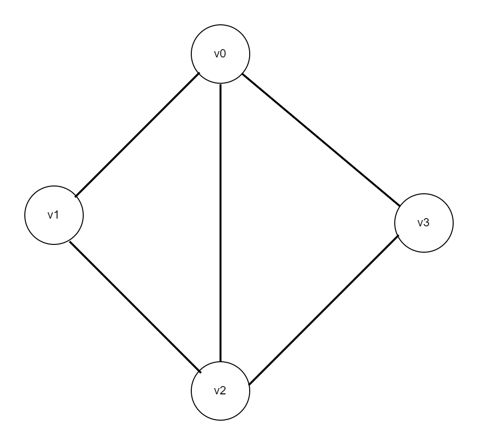
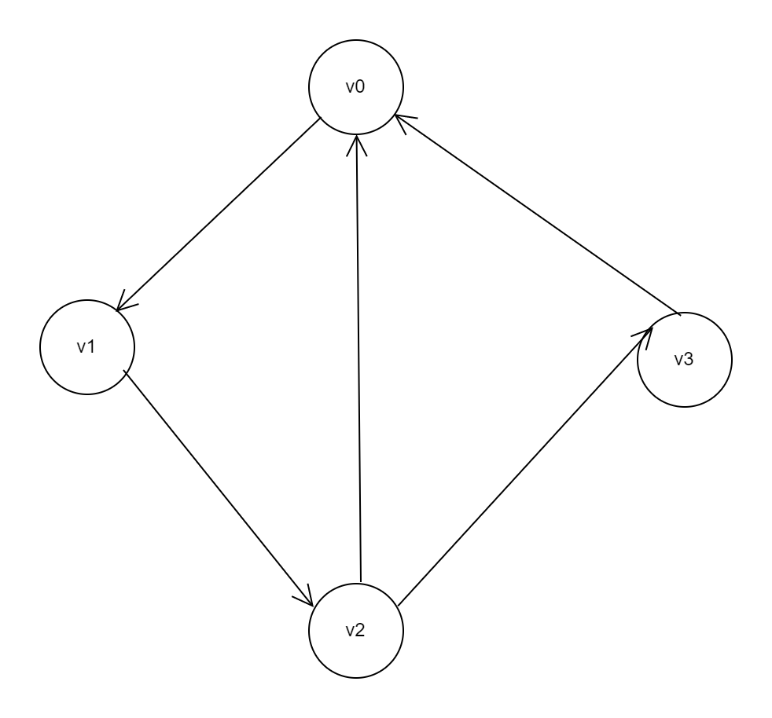
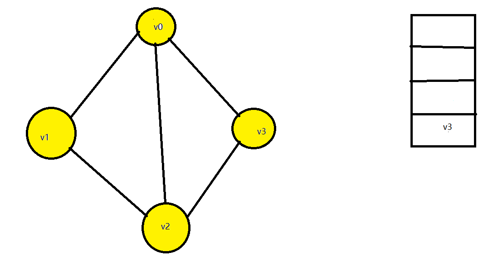
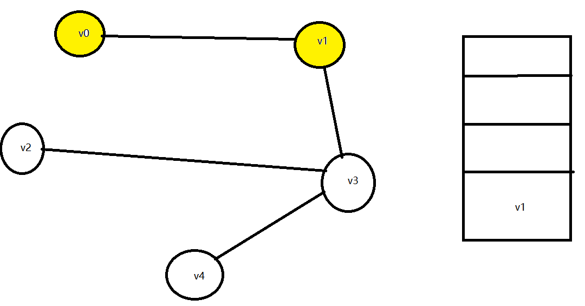
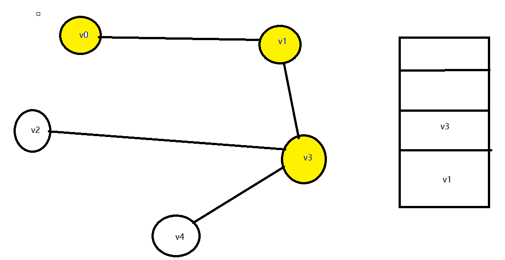
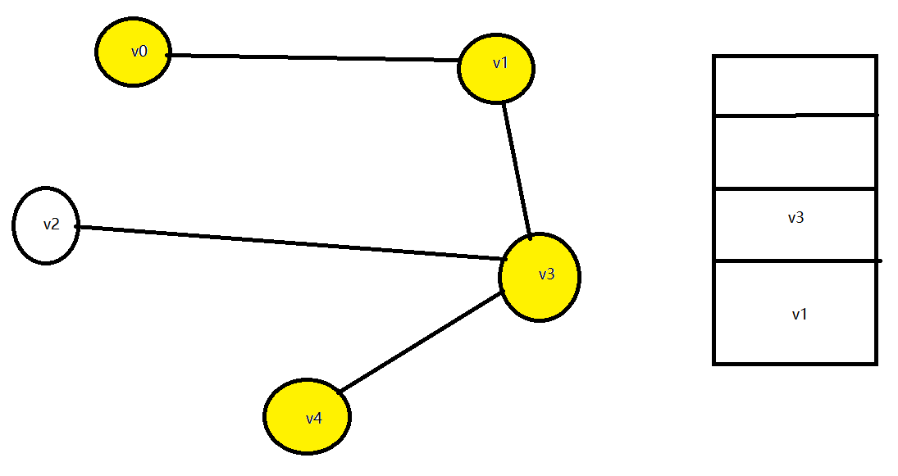
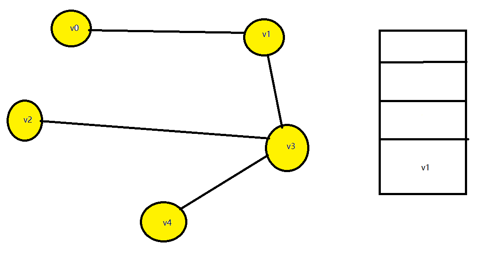

这是我的结课总结，认识或许还有很多不足（自己也能感觉到自己的菜），仅供参考，请勿抄袭，谢绝转载，谢谢！ 

如有不懂，可发友善留言讨论。

目录

[一、 图的定义极其相关基本概念 ](#_Toc17825)

[1.1 图的定义 ](#_Toc11785)

[1.2 图的相关概念 ](#_Toc32436)

[1.3 图的抽象数据类型 ](#_Toc32507)

[二、 图的存储 ](#_Toc14211)

[2.1 图的邻接矩阵存储 ](#_Toc28996)

[2.1.1 无向图的邻接矩阵表示 ](#_Toc11174)

[2.1.2 有向图的邻接矩阵表示 ](#_Toc20606)

[2.1.3 函数解析 ](#_Toc1323)

[2.2 图的邻接表存储 ](#_Toc24562)

[2.2.1 无向图的邻接表表示 ](#_Toc32226)

[2.2.2 有向图的邻接表表示 ](#_Toc3892)

[2.2.3函数解析 ](#_Toc30729)

[2.3 图的度 ](#_Toc3228)

[2.3.2 邻接表求度数 ](#_Toc12642)

[2.4 两种存储方式的比较 ](#_Toc27778)

[2.5 带权图 ](#_Toc17569)

[三、 图的遍历 ](#_Toc16146)

[3.1 广度优先遍历 ](#_Toc24131)

[3.1.1 算法分析与方法选择 ](#_Toc29208)

[广度优先遍历过程图示图示 ](#_Toc19344)

[3.2 深度优先遍历 ](#_Toc1204)

[3.2.1 算法分析与方法选择 ](#_Toc15185)

[3.2.2 递归法 ](#_Toc6478)

[3.2.3 非递归法（栈法） ](#_Toc16905)

[四、 拓扑排序 ](#_Toc26416)

[4.1 算法分析 ](#_Toc9064)

[4.2 应用 ](#_Toc3756)

[五、 最小生成树 ](#_Toc17484)

 

一、图的定义极其相关基本概念

1.1 图的定义

图是表示物件与物件之间关系的数学对象。

 

1.2 图的相关概念

表示方法：二元组或三元组。其中二元组常用，即用“顶点”集合和“边”集合表示。

图的分类：有向图和无向图。

度：与顶点V相关联的边的条数。对于无向图，可分为入度和出度，以顶点V为起点的边的条数即为V的出度，以顶点V为终点的边的条数即为V的入度。

图的存储：常用的有邻接矩阵存储、邻接表存储。

图的遍历：深度优先遍历（DFS）和广度优先遍历（BFS）。

重要概念：最小生成树，拓扑排序。

 

1.3 图的抽象数据类型

ADT Graph is

operations

创建一个空图

Graph createGraph(void)

判断图g是否为空，是则返回1，否则返回0

Int isNullGraph(Graph g)

找图中的第一个顶点

Vertex firstVertex(Graph g)

找图中顶点vi的下一个顶点Vertex nextVertex(Graph g,Vertex vi)

在图中查找顶点

Vertex searchVertex(Graph g,Vertex vi)

在图g中增加一个顶点

Graph addVertex(Graph g,Vertex vi)

在图g中删除一个顶点和与该点相关联的所有边

Graph deleteVertex(Graph g,Vertex v)

在图g中删除一条边e(<vi,vj>或者(vi,vj))

Graph deleteEdge(Graph g,Vertex vi,Vertex vj)

在图g中增加一条边<vi,vj>或者(vi,vj)

Graph addEdge(Graph g,Vertex vi,Vertex vj)

判断图g中是否存在一条指定边<vi,vj>或者(vi,vj)

int findEdge(Graph g,Vertex vi,Vertex vj)

找图g中与顶点v相邻的第一个顶点

Vertex firstAdjacent(Graph g,Vertex v)

/*v与返回顶点构成的边也称为与v相关联的第一条边*/

找图g中与顶点vi相邻的，相对相邻顶点vj的，下一个相邻顶点

Vertex nextAdjacent(Graph g,Vertex vi,Vertex vj)

/*vi与返回顶点构成的边也称为是vi与vj构成的边的下一条边*/

 

二、图的存储

2.1 图的邻接矩阵存储

2.1.1 无向图的邻接矩阵表示

数学表示

无向图就是边没有方向的图，对于图G(V,E),V={v1,v2,v3,...,vn}是图G的顶点集，E={e1,e2,e3,...,en}是图G的边集。无向图的每一条边都可以用一个无序对表示，且为圆括号，如e =（vi,vj）表示顶点(vi,vj)之间的边。边(vi,vj)和边(vj,vi)表示同一条边。

邻接矩阵是用一个二维矩阵存储图中各个顶点和边的信息的存储方式，它是完全使用顺序存储方式的。在邻接矩阵中，存储的是顶点和顶点之间的相邻关系。对于无权图，用1表示相邻，0表示不相邻。

如图所示为一个矩阵（矩阵1），若该矩阵为图G的邻接矩阵（编号从1开始），则矩阵中的a(ij)存储的是顶点v(i)到v(j)之间的边，即边(vi,vj)（或边(vj,vi)）的信息。

矩阵1

 

对于无向图，由于前文提到的边(vi,vj)和边(vj,vi)是同一条边，故矩阵中a(ij)=a(ji)，从而可以得到如下矩阵（矩阵2）。

矩阵2

从矩阵中可以看到无向图的邻接矩阵是关于主对角线对称的。

 

数据结构表示

前文提到，邻接矩阵的存储是完全地采用顺序存储方式进行存储的。即二维数组实质上是一段连续的存储空间。

1. **typedef** **struct** {

2.  **int** vcount;

3.  **int** type;

4.  **char** vexs\[N\];

5.  **int** arcs\[N\]\[N\];

6. } GraphMatrix;

代码块1

上述代码（代码块1）为邻接矩阵的数据结构C语言代码。其中共有4个成员变量，vcount是记录图中顶点个数的整型变量；type用于指定图的类型，有向图用0表示，无向图用1表示；vex\[N\]是图中顶点的信息；arcs是存储图中边信息的整型二维数组，arcs\[i\]\[j\]表示vex\[i\]和vex\[j\]之间的边。

2.1.2 有向图的邻接矩阵表示

有向图的邻接矩阵表示和无向图基本相同，仅存在以下几个不同：

（1）有向图的“边”称为“弧”；

（2）有向图中弧的数学表示方法为有序对，且为尖括号表示，如<vi,vj>表示顶点 vi到顶点vj的有向弧；

（3）如下矩阵，有向图中，邻接矩阵中的a(ij)与a(ji)不一定相等，即其邻接矩阵不一定是对称矩阵。

矩阵3

 

（4）有向图邻接矩阵中的a(ij)表示以vi为起点，vj为终点的边；

（5）有向图进行邻接矩阵存储时，仅对于输入的边（vi,vj），仅将二维数组vex 中的arcs\[i\]\[j\]置为1；

 

有向图的数据结构和无向图完全一致。

 

2.1.3 函数解析

邻接矩阵的基本操作比较简单，主要有邻接矩阵的初始化、点集的输入和边信息的输入。

(1) GraphMatrix \*initGraphMatrix();

函数功能：初始化邻接矩阵，并完成边集的输入（不输入顶点信息）。

输入：图的类型、顶点数、边数；边的起始、终点顶点编号。

返回值：初始化完成并完成顶点集和边集存储的邻接矩阵。

主要思路：把图的类型和顶点数、边数输入完成后，首先使用双重循环将邻接矩阵中的每个元素置为0，再输入所有的边，每条边用former表示一端的下标，latter表示另一端的下标。对于无向图（type=0）,将邻接矩阵中的第former行第latter列的元素(arcs\[former\]\[latter\])和第former行第latter列的元素(arcs\[latter\]\[former\])置为1。对于有向图（type=1），则仅将邻接矩阵中的第former行第latter列的元素(arcs\[former\]\[latter\])置为1。

 

2.2 图的邻接表存储

2.2.1 无向图的邻接表表示

数学表示

邻接表是用顺序表和链表混合存储图信息的存储方式，其存储方法与哈希表存储方法中的拉链法类似，即使用一个顺序表保存顶点信息和一个指针域，该指针域指向一个链表，该链表为与该顶点邻接的顶点的链表。邻接表的结构如下图所示,图2是图1所示无向图的邻接表。

 

图 1 无向图

 

 

图 2 无向图的邻接表

由图可以看到，在邻接表中，大体上可以分为两个部分，即左边的顺序表和右边的链表，左边的顺序表用于存储顶点以及顶点的信息；右边的链表用于存储图中边的信息，称为边表。每一个顶点都带有一个边表。与某顶点v邻接的所有顶点都存储在v的边表中。同时，在顺序表中，顶点v除了存储顶点信息的数据域，还带有一个指针域，该指针指向v的边表的第一个元素。如图2中的邻接表中，0号顶点的数据域存有数据v0，指针域存有指针P0，该指针指向0号顶点的边表，该边表中存储了与0号顶点相邻的所有顶点的编号，即1号、2号和3号顶点。

 

数据结构表示

前文提到，邻接表是使用顺序表和链表混合存储图的数据结构。

1. **typedef** **struct** { 

2.  **char** vertex;

3.  **int** degree;

4.  EdgeList edgelist;

5. } VexNode; 

代码块2

 

1. **typedef** **struct** { 

2.  VexNode vexs\[N\];

3.  **int** type;

4.  **int** vcount;

5. } GraphList; 

代码块3

 

上述代码为邻接表的数据结构C语言代码，代码块2中共包含3个成员变量，代码块3中也有3个成员变量。代码块3中的vex\[N\]是用于存储顶点信息和该顶点对应的边表指针的顺序表，即图的顶点表，type是图的类型，vcount是图中顶点的个数。代码块2是每个顶点的数据结构，vertex是顶点的信息，degree是顶点的度，edgelist是顶点的边表指针。可以看出，顶点表是一个顺序表，而边表是一个链表。

 

2.2.2 有向图的邻接表表示

有向图的邻接表分为两种，即出边表和入边表。出边表即把所有以某顶点v为起点的弧的终点存储到v的边表中，入边表即把所有以某顶点v为终点的弧的起点存储到v的边表中。如下图，图4是图3中有向图的出边表，而图5是该有向图的入边表。其数据结构与的设计无向图完全一致。

 

图 3 有向图

 

图 4 有向图的出边表

 

图 5 有向图的入边表

2.2.3函数解析

（1）GraphList \*initGraphList();

函数功能：初始化邻接表，并完成顶点和边信息的输入和保存。

输入：图的类型、图的顶点数和边数；顶点信息；边的起始和终止顶点编号，以及该边的权值。

返回值：初始化好，并且已经完成顶点和边输入极其存储的邻接表GL。

主要思路：

（1）初始化：创建一个邻接表对象，接收完图类型、顶点和边数输入后，将邻接表中每个顶点的入度初始化为0；

（2）构建邻接表：①输入点集并保存在顶点表中；

②为每一个顶点申请一个边表存储空间；

③输入边信息，用三个变量former、latter和weight分别存储边的起点下标、终点下标和权值；

④根据输入的边的起点、终点把顶点v的邻接顶点插入到v的边表的头部。对于无向图，需要在下标为former的顶点的边表中插入latter，还要在下标为latter的顶点的边表中插入former。同时还要在边表的相应结点中存储v到该结点的边的权值。在边表结点中还要设置一个指针域用于指向下一个邻接顶点。对于有向图，则不需要在下标为latter的顶点的边表中插入former,其余与无向图一致。

 

2.3 图的度

数学表示

与顶点V相关联的边的条数。对于无向图，可分为入度和出度，以顶点V为起点的边的条数即为V的出度，以顶点V为终点的边的条数即为V的入度。

2.3.1 邻接矩阵求度数

矩阵4

 

如上矩阵（矩阵4）是图1无向图的邻接矩阵，由于邻接矩阵中的1表示某顶点vi与vj邻接，所以上述矩阵中的第i行（或第j列）的1的个数即为下标为i（或j）的顶点的度数。

矩阵5

 

如上矩阵（矩阵5）是图3有向图的邻接矩阵，由于邻接矩阵中的1表示图中存在某顶点vi到vj的有向边，所以上述矩阵中的第i行的1的个数即为下标为i的顶点的出度，第j列的1的个数即为下标为j的顶点的入度。

算法

1. **int** vexs\[N\]\[N\]; 

2.  **for** (**int** i = 0; i < vexs.length; i++) { 

3.  **int** degree = 0; 

4.  **for** (**int** j = 0; j < vexs.length; j++) { 

5.  **if** (vexs\[i\]\[j\]==1){ 

6.  degree++; 

7.  } 

8.  } 

9.  printf("%d\\n",degree); 

10.  } 

代码块4 无向图矩阵求度数

 

1. **int** vexs\[N\]\[N\]; 

2.  **for** (**int** i = 0; i < vexs.length; i++) { 

3.  **int** inCount = 0; 

4.  **int** outCount = 0; 

5.  **for** (**int** j = 0; j < vexs.length; j++) { 

6.  **if** (vexs\[j\]\[i\]!=0&&i!=j){ 

7.  inCount++; 

8.  } 

9.  **if** (vexs\[i\]\[j\]!=0&&i!=j){ 

10.  outCount++; 

11.  } 

12.  } 

13.  printf("%d %d",inCount,outCount); 

14.  } 

代码块5 有向图矩阵求度数

2.3.2 邻接表求度数

邻接表求度数比较简单，如图2无向图的邻接表中，求顶点vi的度数，只需查找vi的边表中顶点的个数即可。而对于图3有向图，要求顶点出度则到如图4的出边表中查找相应顶点的边表中顶点个数即可，要求顶点入度则到图5的入边表中查找相应顶点的边表中顶点个数即可。

算法

1. **void** function(GraphList GL) { 

2.  VexNode vexs\[\] = GL->vexs; 

3.  **for** (**int** i = 0; i < vexs.length; i++) { 

4.  **int** degree = 0; 

5.  EdgeList EL = GL->vexs\[i\].edgelist; 

6.  **while** (EL!=NULL){ 

7.  degree++; 

8.  EL = EL->nextedge; 

9.  } 

10.  printf("%d\\n",degree); 

11.  } 

12. } 

代码块6 邻接表求度数

 

2.4 两种存储方式的比较

邻接矩阵和邻接表各有优缺点，分别适合不同的场景。

<table cellspacing="0" width="619"><tbody><tr class="firstRow" style="height:96px"><td style="padding: 0px 7px; border-width: 1px; border-color: windowtext;" valign="center" width="155"></td><td style="padding: 0px 7px; border-width: 1px; border-color: windowtext;" valign="center" width="155">优点</td><td style="padding: 0px 7px; border-width: 1px; border-color: windowtext;" valign="center" width="155">缺点</td><td style="padding: 0px 7px; border-width: 1px; border-color: windowtext;" valign="center" width="155">适用场景</td></tr><tr style="height:99px"><td style="padding: 0px 7px; border-left-width: 1px; border-left-color: windowtext; border-right-width: 1px; border-right-color: windowtext; border-top: none; border-bottom-width: 1px; border-bottom-color: windowtext;" valign="center" width="155">邻接矩阵</td><td style="padding: 0px 7px; border-left-width: 1px; border-left-color: windowtext; border-right-width: 1px; border-right-color: windowtext; border-top: none; border-bottom-width: 1px; border-bottom-color: windowtext;" valign="center" width="155">①快速确定两点之间是否有边；②快速添加、删除边</td><td style="padding: 0px 7px; border-left-width: 1px; border-left-color: windowtext; border-right-width: 1px; border-right-color: windowtext; border-top: none; border-bottom-width: 1px; border-bottom-color: windowtext;" valign="center" width="155">在存储稀疏图时浪费的空间较多</td><td style="padding: 0px 7px; border-left-width: 1px; border-left-color: windowtext; border-right-width: 1px; border-right-color: windowtext; border-top: none; border-bottom-width: 1px; border-bottom-color: windowtext;" valign="center" width="155">稠密图（边数e>nlog(2)n）</td></tr><tr style="height:99px"><td style="padding: 0px 7px; border-left-width: 1px; border-left-color: windowtext; border-right-width: 1px; border-right-color: windowtext; border-top: none; border-bottom-width: 1px; border-bottom-color: windowtext;" valign="center" width="155">邻接表</td><td style="padding: 0px 7px; border-left-width: 1px; border-left-color: windowtext; border-right-width: 1px; border-right-color: windowtext; border-top: none; border-bottom-width: 1px; border-bottom-color: windowtext;" valign="center" width="155">节省空间，之存储存在的边</td><td style="padding: 0px 7px; border-left-width: 1px; border-left-color: windowtext; border-right-width: 1px; border-right-color: windowtext; border-top: none; border-bottom-width: 1px; border-bottom-color: windowtext;" valign="center" width="155">求顶点的度时，需要遍历整个链表</td><td style="padding: 0px 7px; border-left-width: 1px; border-left-color: windowtext; border-right-width: 1px; border-right-color: windowtext; border-top: none; border-bottom-width: 1px; border-bottom-color: windowtext;" valign="center" width="155">稀疏图（边数e<nlog></nlog></td></tr></tbody></table>

表 1 两种存储方式的比较

 

2.5 带权图

图中每条边赋予相应权值的图称为带权图（赋权图）。

若图用邻接矩阵存储，则直接将矩阵中的1改为相应边上的权值即可；若用邻接表存储，则在边表的相应邻接结点上存储相应权值即可。对于无向图，(vi,vj)的权值和(vj,vi)的权值相同。

三、图的遍历

3.1 广度优先遍历

3.1.1 算法分析与方法选择

广度优先遍历是遍历图中的顶点时，优先遍历某顶点的所有邻接顶点的算法。如图1中从顶点v0开始的广度优先遍历结果为（v0,v1,v3,v2），从v1开始的广度优先遍历结果为（v1,v0,v2,v3）。可见，广度优先遍历遇到顶点时，总是会先把当前顶点和它邻接的所有顶点遍历完，再跳到它所遍历的第一个邻接顶点上，重复上述操作。这种方式的特点和队列的特点类似。所以可以考虑使用队列来完成遍历。如图，右边的是队列，上面是队头，下面是队尾。

广度优先遍历过程图示图示

 

图 6

 

图 7

 

图 8

 

图 9

 

图 10

 

算法

1.  **int** \*visited = makeFlag(G->vcount); 

2.  **int** v = 0; 

3.  **int** Q\[20\];//顺序队列 

4.  **int** front, rear; 

5.  front = rear = -1; 

6.  **struct** EdgeNode \*p; 

7.  printf("%c ", G->vexs\[0\].vertex); 

8.  visited\[v\] = 1; 

9.  Q\[rear++\] = v;//已访问结点入队 

10.  **int** t; 

11.  **while** (front != rear) { 

12.  v = Q\[front++\];//结点出队 

13.  p = G->vexs\[v\].edgelist; 

14.  **while** (p) { 

15.  t = p->endvex; 

16.  **if** (visited\[t\] == 0) { 

17.  printf("%c ", G->vexs\[t\].vertex); 

18.  visited\[t\] = 1; 

19.  Q\[rear++\] = t;//已访问结点入队 

20.  } 

21.  p = p->nextedge; 

22.  } 

23.  } 

24. } 

代码块7

3.2 深度优先遍历

3.2.1 算法分析与方法选择

深度优先遍历是在遍历图中的顶点时，优先持续向下遍历直到下一个为空的算法。

如下图，从v0开始的深度优先遍历结果为(v0,v1,v3,v2,v4)，从v1开始的深度优先遍历结果为（v1,v3,v2,v4,v0）。可见，深度优先遍历在遍历图中的顶点时，总是先持续向下遍历，直到下一个为空时，再一步步回头遍历前面遍历过的顶点的邻接顶点。这个特点和栈的特点很相似，所以可以考虑使用栈或者递归来完成遍历。

 

图 11

深度优先遍历过程图示图示

 

图 12

 

图 13

 

图 14

 

图 15

 

图 16

 

图 17

3.2.2 递归法

算法主要代码

1. **void** DFS(GraphList *G,* **int** i, **int** visited) { 

2.  visited\[i\] = 1; 

3.  printf("%c ", G->vexs\[i\].vertex); 

4.  

5.  **struct** EdgeNode \*p = G->vexs\[i\].edgelist; 

6.  **while** (p) { 

7.  **if** (!visited\[p->endvex\]) { 

8.  DFS(G, p->endvex, visited); //递归深度遍历 

9.  } 

10.  p = p->nextedge; 

11.  } 

12. } 

 

1. **void** DFS\_list(GraphList \*G) { 

2.  **int** \*visited = makeFlag(G->vcount); 

3.  **int** i; 

4.  **for** (i = 0; i < G->vcount; i++) { 

5.  visited\[i\] = 0; 

6.  } 

7.  **for** (i = 0; i < G->vcount; i++) { 

8.  **if** (visited\[i\] != 1) { 

9.  DFS(G, i, visited); 

10.  } 

11.  } 

12.  

13. } 

3.2.3 非递归法（栈法）

1. **void** DFS\_list(GraphList \*G) { 

2.  //非递归法（栈），卒！ 

3.  **int** Stack\[20\]; 

4.  **int** top = -1; 

5.  **struct** EdgeNode \*p; 

6.  **int** v = 0; 

7.  **int** \*visited = makeFlag(G->vcount); 

8.  **int** t; 

9.  printf("%c ",G->vexs\[0\].vertex); 

10.  visited\[v\] = 1; 

11.  Stack\[top+1\] = v; 

12.  top++; 

13.  **while** (top!=-1){ 

14.  v = Stack\[top\]; 

15.  p = G->vexs\[v\].edgelist; 

16.  **while** (p){ 

17.  printf("while"); 

18.  t = p->endvex; 

19.  **if** (visited\[t\]==0){ 

20.  printf("66 "); 

21.  

22.  printf("%c ",G->vexs\[t\].vertex); 

23.  printf("77 "); 

24.  visited\[t\] = 1; 

25.  printf("88 "); 

26.  Stack\[top++\] = t;//已访问结点入栈 

27.  printf("\[%d %d\] ",top,t); 

28.  } 

29.  p = p->nextedge; 

30.  } 

31.  } 

32. } 

 

四、拓扑排序

4.1 算法分析

拓扑排序是一个有向无环图的所有顶点的线性序列，每个顶点再序列中仅出现一次，且如果序列中存在顶点v0到v1的路径，那么在序列中v0必定出现在v1之前。

拓扑排序的算法思想如下：

1. 在一个有向图中，选择一个入度为0的顶点，将该顶点输出；

2. 从图中删除该顶点以及所有以该顶点为起点的有向边。

3. 重复1和2，直到输出完所有顶点为止。

 

图 18

如图18所示，该图的拓扑排序序列为（v1,v2,v4,v3,v5）。

算法主要代码

1. **void** Top\_list(GraphList \*G) { 

2.  **for** (**int** i = 0; i < G->vcount; i++) { 

3.  **if** (G->vexs\[i\].degree == 0) { 

4.  printf("%c ", G->vexs\[i\].vertex); 

5.  EdgeList EL = G->vexs\[i\].edgelist; 

6.  **while** (EL != NULL) { 

7.  G->vexs\[EL->endvex\].degree--; 

8.  EL = EL->nextedge; 

9.  } 

10.  } 

11.  } 

12.  

13. } 

 

4.2 应用

拓扑排序常用于解决有依赖关系的复杂任务。比如大学生选修课程的现后顺序，使用拓扑排序就可以得到满足课程依赖关系的选修顺序。又比如工程项目，很多工程项目是需要前面的先完成，后面的才能做的，使用拓扑排序就可以排出正确的施工顺序。

五、最小生成树

最小生成树是一个包含原图所有顶点，且边最少的连通图子图。有n个顶点的图的最小生成树中有n-1条边。

求最小生成树的算法有克鲁斯卡尔算法和普里姆算法，其中普里姆算法较常用。

算法步骤

（1）输入：一个加权连通图，其中顶点集合为V，边集合为E；

（2）初始化：Vnew= {x}，其中x为集合V中的任一节点（起始点），Enew= {},为空；

（3）重复下列操作，直到Vnew= V：

a.在集合E中选取权值最小的边<u, v>，其中u为集合Vnew中的元素，而v不在Vnew集合当中，并且v∈V（如果存在有多条满足前述条件即具有相同权值的边，则可任意选取其中之一）；

b.将v加入集合Vnew中，将<u, v>边加入集合Enew中；

（4）输出：使用集合Vnew和Enew来描述所得到的最小生成树。

算法代码

1. **int** getWeight(GraphList G, **int** start, **int** end) 

2. { 

3.  **struct** EdgeNode \*node; 

4.  

5.  **if** (start==end) 

6.  **return** 0; 

7.  

8.  node = G.vexs\[start\].edgelist->nextedge; 

9.  **while** (node!=NULL) 

10.  { 

11.  **if** (end==node->endvex) 

12.  **return** node->weight; 

13.  node = node->nextedge; 

14.  } 

15.  

16.  **return** 10000; 

17. } 