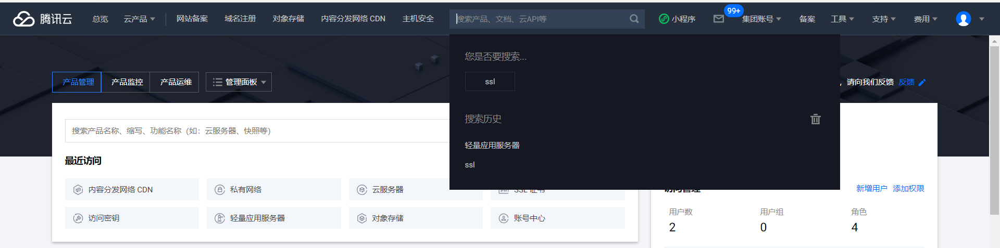
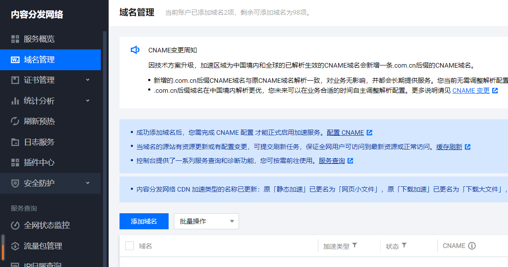
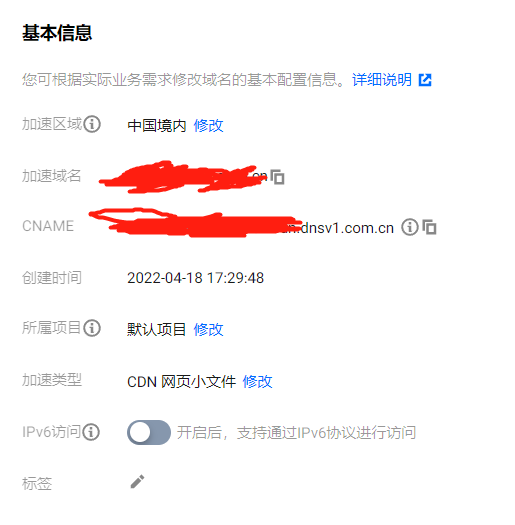
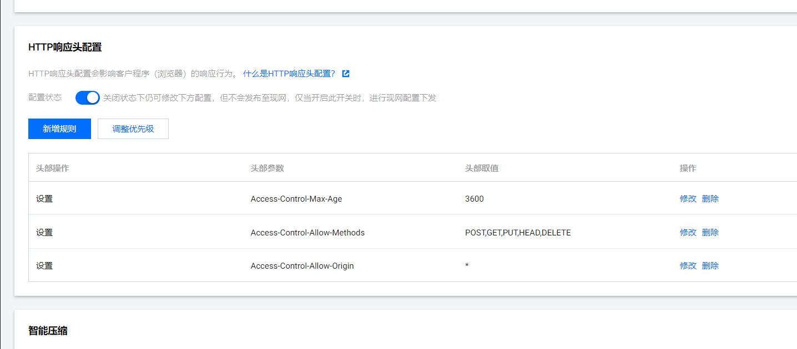

最近给我的个人网站开通了CDN服务，折腾了好久才算是“可以用了”，虽然还有一些小小的问题，但好在不是那么地影响使用。其实折腾CDN这回事，我在去年的1月、2月份已经折腾了很久了，当时是第一次去折腾这玩意儿，折腾很久没有个结果，后面不了了之了。但是到了今年，随着学的的东西的增加，有很多东西需要记录，而我又更喜欢一个自己小窝，于是我重新开通了个人网站，并且接入了CDN，重新折腾了一遍。

### CDN是什么

CDN全称是“内容分发网络”，顾名思义，它就是用来分发内容的网络，就是一层覆盖在原有网络之上的网络层。

### CDN有什么用

CDN能够提供访问加速功能，还能提供一定的网站防护作用。加速功能就是通过各大云厂商设置在各地的边缘节点，将接入CDN服务的用户的网站的服务器（称为源站）中的内容缓存过来，然后再由各个边缘节点负责所在区域的内容分发工作，从而能够让各个访问网站的用户能够就近获取内容，从而加快访问速度。而网站防护作用就是通过接入CDN，让CDN接管了内容的分发任务，用户访问的是CDN节点的服务器，暴露的是CDN节点的IP地址，而不是用户源站的IP地址，从而降低了用户源站被攻击的风险。

### 如何选择CDN提供商

如今国内的CDN服务厂家有很多，比如各个大厂：阿里、腾讯、百度，当然还有UCloud、青云、天翼云这些名声没有那么高的，这些厂商的CDN服务质量都差不多，都值得选择。在此要提醒各位的是，选择任何云服务都一定要选择有点名声的那些，不要去选择那些完全不知名的18线厂家（除非你是白嫖的，那就当我没说），因为那些厂家的服务往往没有保障，等你遇到问题的时候无处寻答案，你才会感到绝望。就像这次我给我的网站接入CDN，选择的是腾讯云的CDN，就遇到了不少问题，有些问题是自己难以发现，甚至是不可发现的，但是问客服就能很快找到问题的所在。

### 如何为网站接入CDN服务

笔者只用过腾讯云和百度智能云的CDN，下面以腾讯云为例介绍接入步骤：

#### 打开腾讯云官网

如图，点击右上角的控制台

#### 找到CDN产品

如果页面中没有CDN，可以在搜索框中搜索，点击进入。

#### 点击侧边栏的域名管理

进入域名管理页面后，再点击蓝色的添加域名按钮，开始配置源站域名信息。

#### 配置域名信息

- 域名配置

加速区域：可以根据实际情况选择，不过考虑到个人网站一般都是给国内用户访问而已，所以一般情况下就是选择中国境内即可，如果你的用户群体中有国外用户，那么可以选择“全球”。

加速域名：就是你为你的网站注册的域名，你想给用户访问的那个网址。（注：建议的域名类型是主域名和www域名。主域名：example.com；www域名：www.example.com)

加速类型：个人网站选择“网页小文件”即可，上面是普通的CDN，下面是ECDN，普通CDN是可以用流量包抵扣访问流量的，ECDN只能按量付费，而且个人网站需要缓存的只有一些静态的文件，比如图片、小视频，js文件、css文件、HTML文件 ，都是些网页小文件，所以“网页小文件”是最好的选择。

IPv6访问：可以不用管。

所属项目：”默认项目“即可。

- 源站配置

源站类型：选择自有源。

回源协议：选择HTTPS。

源站地址：全部文件填写自己的服务器的IP地址，后面地址和权重不用填。

回源HOST：在填写加速域名的时候会自动填写，也就是和加速域名一致即可。

- 服务配置

此项全部都不用改动，确认提交即可。

#### 设置CNAME

配置完毕之后，在域名管理页面点击刚刚已经配置好的域名，然后出现以下界面：

复制此处的CNAME地址，到你的域名服务商处，添加一个解析记录。

- 记录类型：**CNAME**。
- 主机记录：如果你加速域名填写的是主域名，此处填写一个**@**符号；如果你加速域名填写的是www域名，此处填写**www**三个字母。
- 记录值：上面复制的**CNAME地址**。
- 其它不用管，完成添加。

#### 测试CDN

- 刷新预热

刚刚接入CDN服务的网站，CDN节点还没有缓存源站的内容，所以不起作用，可以多访问几次就可以访问到CDN节点了。或者可以在CDN控制台选择“刷新预热”。然后选择目录刷新，填写你的源站根目录，比如你设置了两个加速域名：**www.example.com**和**example.com**，那么你要刷新预热的目录就是**https://www.example.com/**和**https://example.com/**，一行填写一个，提交即可。

- 查询IP地址归属

测试的方法是用浏览器直接访问你的加速域名，比如用Chrome浏览器访问，先按**F12**或者在浏览器窗口中**右键选择检查**，打开开发者工具，然后再在地址栏输入你的加速域名，回车，可以看到开发者工具中有许多项目或者请求，点击**network（网络）**项目，可以看到该页面的网络请求，点击任意一个请求，再点击**headers（头信息）**，然后在**General**中可以看到**Remote Address**，复制这个IP地址（不包括443端口号），到腾讯云CDN控制台**IP归属查询**中输入此IP地址即可看到此IP是否属于腾讯云CDN节点IP，如果是，那么说明该请求**命中了CDN缓存**，如果不是（而是你自己的服务器IP地址）则没有命中。

- x-cache-lookup字段

也可以在headers中找到**x-cache-lookup**字段，如果显示**Hit From Disktank3 Gz**，说明命中了CDN节点的硬盘，属于**命中了CDN节点**的；如果显示**Hit From Inner Cluster**，说明命中了CDN节点服务器的内存，也是属于**命中了CDN节点**的；如果显示**Cache Miss**，说明没有命中CDN节点，而是回源获取内容了。还有一种情况，就是这三种都出现，或者出现大于一种，不用担心，可能是你开启了头信息透传，是可以在CDN控制台关闭的，但是开不开都没必要管它。CDN的原理是，用户访问网站，引导到最近的CDN节点，如果此节点没有所需要的内容，则继续CNAME到该节点周围的其它节点，看看有没有，如果没有，则继续寻找下一个，如果所有节点都没有，就会回源，也就是说CDN寻找内容是**递归寻找**的。如果开启了头信息透传，那么每一次寻找下一个节点的时候，都会带着头信息过去，就会出现很多次**x-cache-lookup**。

### 接入CDN遇到的问题

#### 网页小图标和CSS样式不显示

出现这种问题的原因是节点跨域访问的原因，只需要去CDN控制台设置一下跨域访问规则即可。

**CDN控制台->域名管理->要配置的域名->高级配置->HTTP响应头配置**，增加如下规则即可，主要是第三个，其它的可以添加也可以不添加。

`access-control-allow-origin: *`

#### 首页显示异常，其它页面正常

除了首页异常，还有所有页面资源链接也异常，即在开发者工具中看到的请求和资源链接很多都显示了源站IP地址，别忘了我们接入CDN有一个目的就是隐藏自己的源站IP地址，这明显事与愿违了！这可能只是我遇到的问题，因为全网都搜不到答案，最终是靠腾讯云客服解决的。具体是首页只能加载出php渲染的HTML页面，其它任何东西都不显示，包括CSS和图片、图标。我也是和客服对线了很久才找到问题所在，但是我至今不知道为何会出现这样的问题，自从接入CDN以来我从来没有修改过首页的代码，为什么会出现文件版本的差异。客服通过拉取CDN日志，说是我源站的问题，于是我试着把域名直接解析到源站，而不是解析到CDN，结果是可以正常访问，客服让我**刷新CDN缓存**，然后我刷新了**静态文件所在的两个目录**（是递归刷新的），但是问题依旧，客服也头疼了。然后客服又对比了我的源站首页文件的md5和存在于CDN节点里面的我的网站首页文件的md5，说这两个文件不一样，而恰好我的首页是index.php，并不在静态文件目录中，所以没有被我刷新。所以客服最终给的答案是**刷新整个网站根目录的所有文件**（递归刷新），即**https://www.example.com/**中所有的文件，还真有效！！！

#### 首页显示的文章浏览量不更新

这个问题出现的原因是php存在CDN节点中，只有第一次访问的时候它被执行了，所以后面就没法动态更新了。解决的办法是看看你的博客软件有没有提供相关的动态更新功能，或者相关的插件。像我使用的zblog就没有这种功能和插件，所以只能自己用ajax折腾了，我现在还在熟悉zblog的文件结构，折腾可能还需要一段时间，等我折腾好我会更新这篇文章......

------2022-11-17------

学了云计算，更正一个错误：响应头中出现多个x-cache-lookup，并不是因为递归解析，DNS无法携带那些东西(这也是为什么现在的CDN调度算法依然无法做到边缘调度，就近分发的原因)。现在我依然没有搞清楚原因，个人猜测如下：

**因为访问网站的时候，对于动态文件，CDN节点没有做缓存，这时就cache miss，于是CDN节点回源，获取源站渲染的页面，缓存到节点，这时浏览器再次获取，就HIT了**