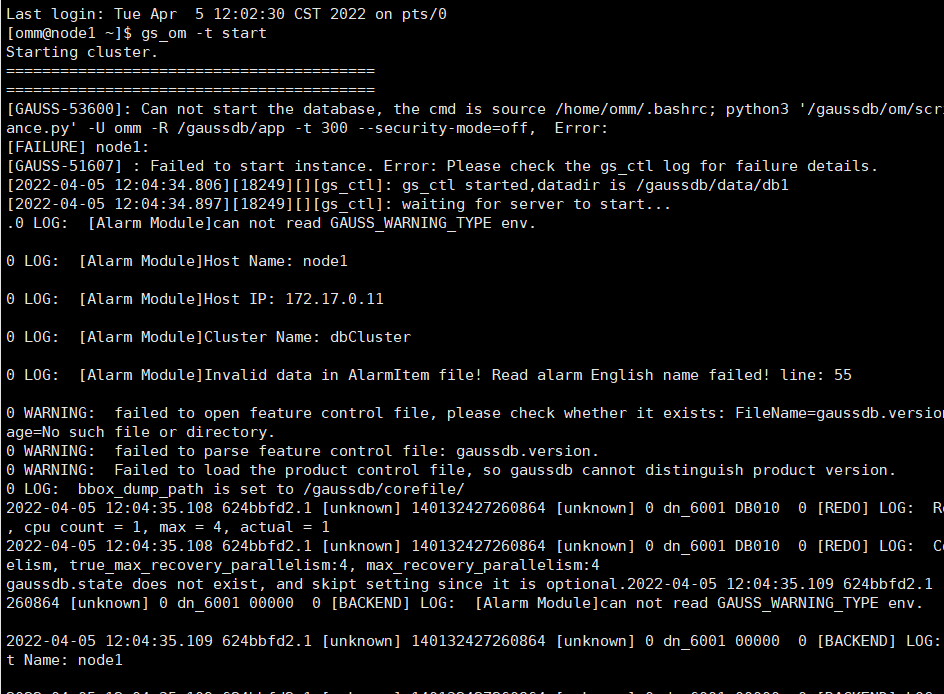

[网站迁移，排版错乱敬请原谅]

<br>

一开始，我以为安装openGauss也就跟手动安装MySQL差不多，但是当我开始动手没多久我就知道我要踩很多坑了，openGauss的社区还非常地渺小，所以即使是我这一篇不起眼的文章，也许都能帮到不少人，所以决定记录下来。

极简版的安装比较简单，我在这里就不多说了，首先是因为我一开始没有看清楚老师的要求，安装了极简版，已经大功告成了才发现不对劲，**<span style="color: #FF0000;">没有gs\_om命令</span>**！所以我觉得应该不难安装。其次是因为**<span style="color: #FF0000;">企业版包含了极简版的所有功能</span>**，所以安装企业版即可。

老师给了安装的指导书，我后面会把主要内容放在后面，但其实我好多东西都没有按照指导书来，因为我一开始就与指导书有了很大的“分歧”。

以下是我的安装踩坑填坑过程：

<span style="color: #FF0000;">主要讲我踩坑的部分，大家可以参照后面的文档安装，遇到坑再来看我的教程。</span>

<span style="color: #FF0000;"></span>

**<span style="color: #FF0000; font-size: 18px;">以下步骤若没有特别说明，均是在root用户下进行操作。</span>**

1. \## 1.下载安装

安装包从官网下载即可：[软件包 | openGauss 2.1.0](https://opengauss.obs.cn-south-1.myhuaweicloud.com/2.1.0/x86/openGauss-2.1.0-CentOS-64bit-all.tar.gz)

1. ### （1）下载到当前文件夹：
```bash
  wget [下载链接]
```
2. ### （2）解压到当前文件夹：
```bash
  tar -zxvf fileName（扩展名也要带上）
```

解压之后会得到更多的压缩文件：


1. ### （3）老师要求安装的是最上面的文件，om应该是代表单机安装的意思（one machine？？？没求证过）。所以就直接解压这个文件就好了，解压方式同上一步
2. ### （4）解压之后是这样的：（下图第一个文件是没有的，需要自己创建，文件内的内容下面文档有说）


### 编写clusterconfig.xml文件，这一步按部就班即可。

1. \### （5）执行集群配置脚本
```bash
python gs_preinstall -U omm -G dbgrp -X  /opt/software/openGauss/clusterconfig.xml
  ```

然后前方高能了，开始出现各种错误了。

这个命令啥意思呢？一定要读懂命令的意思。python是使用python执行python脚本的命令，gs\_preinstall是openGauss提供的一个前置安装脚本，-U omm是创建用户omm，-G dbgrp是为用户omm指定用户组dbgrp，-X是指定配置文件路径，后面的一串就是路径。

1. 2.解决问题
  ------
2. ### （1）我遇到的第一个问题是系统版本问题，因为我电脑上的虚拟机是很久之前就已经安装了的，是CentOS7.9，在openGauss安装完毕之后显示不支持这个系统版本，需要降级到CentOS7.6。这里注意，不是跨大版本降级，只需要使用rpm包即可。
3. #### 1）获取降级包：
```bash
  wget https://www.repo.cloudlinux.com/cloudlinux/migrate/release-files/centos/7/x86<em>64/centos-release-7-6.1810.2.el7.centos.x86</em>64.rpm
  ```
4. #### 2）强制安装：
```bash
  rpm -ivh centos-release-7-6.1810.2.el7.centos.x86_64.rpm --force --nodeps
  ```

**<span style="color: #FF0000;">注意：force是灵魂，没有force会安装不上，因为会与原版本冲突。</span>**

1. #### 3）查看release：
```bash
  rpm -qa |grep -i centos-release
  ```
2. #### 4）移除较新版本的release，降级成功
```bash
  rpm -ev ******（就是上面查出来那个新版的信息）
  ```
3. ### （2）第二个问题是python不可用，具体就是执行脚本的时候显示python：command not found（未找到命令）。原因可能有两个，第一就是系统找不到python在哪儿，第二就是没安装python。

没安装python的可能性很小，CentOS是自带python的，除非你自己闲着没事去删了，那只能重装了（下面会说）。如果是系统找不到，那你就先自己找到，然后建立软连接就可以了。

1. \#### 1）找到python安装目录：
```bash
  whereis python
  ```

注意：像这种文件夹才是正儿八经的python目录，单个文件的不是，因为python的安装包原本就是个压缩包，解压出来就是个文件夹。


在命令行中区分文件和文件夹的方法：

在想查看的目录下执行以下命令：

```bash
ls -l
```

显示的结果中，最左边一列的第一个字母是d就是文件夹（directory）

或者在SSH工具Xshell中，文件夹会以蓝色字体显示：


1. #### 2）创建软连接：
```bash
  ln -s 所查到的python目录 /usr/bin/python
  ```
  
  ```bash
  好像 ln -s 所查到的python目录 /usr/bin 也可以
  ```
2. #### 3）检查是否成功：
```bash
  python -V（V是大写的）
  ```

显示python版本号说明成功了。

1. \### （3）官方脚本中存在使用python3命令执行的脚本，如果系统中没有安装python3，就会导致执行安装脚本到一半时出现报错

<span font-size:="" microsoft="" style="font-family: 微软雅黑, " yahei="">-bash: <span color:="" font-size:="" microsoft="" style="font-family: 微软雅黑, " yahei="">python3</span>: command not found</span>
=====================================================================================================================================================================================================

<span font-size:="" microsoft="" style="font-family: 微软雅黑, " yahei="">办法就是升级python3了。 </span>

1. #### 1）安装依赖：
```
  <pre class="prism-highlight prism-language-bash">yum install openssl-devel bzip2-devel expat-devel gdbm-devel readline-devel sqlite-devel
  ```
2. #### 2）获取python安装包：
```bash
  wget https://www.python.org/ftp/python/3.6.8/Python-3.6.8.tar.xz
  ```
3. #### 3）解压：
```bash
  tar -zxvf Python-3.6.8.tar.xz
  ```
4. #### 4）创建编译安装文件夹：
```bash
mkdir 你想安装的路径和文件夹名称
  ```
5. #### 5）进入解压出来的python文件夹：
```bash
cd Python-3.6.8所在的目录
  ```
6. #### 6）依赖检查、指定安装目录：
```bash
./configure --prefix="第四步中创建的编译安装文件夹的绝对路径"
  ```
7. #### 7）开始编译安装：
```bash
make && make install
  ```
8. #### 8）创建软连接：（参见第二个问题）
```bash
ln -s python目录 /usr/bin/python3
  ```

注意：是/usr/bin/<span style="color: #FF0000;">python3。</span>

1. \### <span style="color: #FF0000;"><span style="color: #000000;">（4）安装python3后yum不可用</span></span>

<span style="color: #FF0000;"><span style="color: #000000;">原因是yum依赖于python2，把yum的python版本换成Python2就行。</span></span>

```bash
vim /usr/bin/yum
```

按i输入，把第一行最后面的python改成python2.7（或原先的python2.x），按ESC结束编辑，输入<span style="color: #FF0000;">: w q三个<span style="color: #000000;">字符、回车退出vim编辑器。</span></span><span style="color: #FF0000;"><span style="color: #000000;"></span></span>

1. ### <span style="color: #FF0000;"><span style="color: #000000;">（5）python3安装不成功，第四个问题中第（6）步执行</span></span>
```bash
./configure --prefix="第四步中创建的编译安装文件夹的绝对路径"
  ```
2. ### <span style="color: #FF0000;"><span style="color: #000000;"></span></span>的时候出现依赖检查失败。

提示是类似于<span style="color: #FF0000;">no working C compiler</span>

我出现这个问题是因为没有安装gcc，因为python3的编译安装是用gcc来编译的。

但是安装gcc时也可能会报错：

[<span color:="" font-size:="" microsoft="" none="" style="margin: 0px; padding: 0px; border: 0px; font-style: inherit; font-variant: inherit; font-stretch: inherit; line-height: 1.35; vertical-align: baseline; box-sizing: inherit; cursor: pointer; user-select: auto; font-family: 微软雅黑, " text-decoration:="" yahei="">Error installing GMP on cygwin "configure: error: could not find a working compiler, see config.log for details"</span><span color:="" microsoft="" style="font-size: 16px; font-family: 微软雅黑, " yahei=""></span>](https://stackoverflow.com/questions/32308950/error-installing-gmp-on-cygwin-configure-error-could-not-find-a-working-compi)
============================================================================================================================================================================================================================================================================================================================================================================================================================================================================================================================================================================================================================================================================

这是GMP安装出错，但我也没找出具体原因，我过了一段时间又去Google了一下解决办法，然后用一位CSDN哥们给的命令成功安装了。[CentOS 7安装gcc,并编辑运行第一个c/c++程序（含vi编辑器的简单使用）](https://blog.csdn.net/qq_40238526/article/details/94039168)

```bash
yum -y install gcc gcc-c++ kernel-devel
```

我不知道是不是不同命令导致的，我就把我成功的命令放这儿吧。

到这里，整个安装脚本应该可以正常执行了！

当你满心欢喜，输入openGauss的密码，准备完成安装时，发现又出错了，别急，可能是clusterconfig.xml配置文件的问题。

1. \### （6）主机名设置不对。

输入hostname可以查看主机名。但是我在腾讯云服务器上面遇到过一个现象，输入hostname显示的是“localhost.localdomain”，但是命令行中显示的却只是“localhost”，配置文件中正确的填法是“localhost.localdomain”，老师给的文档可能有点bug。

1. \### （7）openGauss启动失败，如下图：

很遗憾，这个情况我目前也没有解决，大家遇到这个问题也就自求多福吧。<span style="color: #FF0000;">可能是虚拟机的内存和CPU核心数设置得太低了，大家可以试着调高一点，但不确保可以解决问题。<span style="color: #000000;">或者有其他懂哥的话可以分享一下解决方案。</span></span>

1. \### <span style="color: #000000;">（8）以gs\_开头的命令不可用，显示<span style="color: #FF0000;">-bash:command not found</span></span>

<span style="color: #000000;">这个可以设置环境变量解决，也可以设置软连接解决。</span>

<span style="color: #000000;">在root用户下，设置软连接即可：</span>

<span style="color: #000000;"></span>

```bash
ln -s gs_开头的文件的路径 /usr/bin
```

<span style="color: #000000;"></span><span style="color: #FF0000;">非root用户（omm）下无法访问/usr/bin，所以不能设置软连接</span>，但是在该用户下执行的gs*相关的bash并不多，直接cd到gs*命令所在的目录去执行gs\_命令即可。

1. \### （9）执行安装命令gs\_install时出错


执行后显示错误：

<span style="color: #FF0000; font-family: 微软雅黑, Arial, Narrow, Helvetica, sans-serif;">createdb: too many command line arguments (first is </span><span microsoft="" style="color: #FF0000; margin: 0px; padding: 0px; font-family: 微软雅黑, " yahei="">-- encoding=UTF8</span><span style="color: #FF0000; font-family: 微软雅黑, Arial, Narrow, Helvetica, sans-serif;">)</span>

<span style="color: #FF0000; font-family: 微软雅黑, Arial, Narrow, Helvetica, sans-serif;">（太多命令行参数（第一个是<span style="color: #FF0000; font-family: 微软雅黑, Arial, Narrow, Helvetica, sans-serif;"> </span><span microsoft="" style="color: #FF0000; margin: 0px; padding: 0px; font-family: 微软雅黑, " yahei="">-- encoding=UTF8）</span>）</span>

<span style="font-family: 微软雅黑, Arial, Narrow, Helvetica, sans-serif; color: #000000;">我没有想太多，它嫌太多参数我就直接把它（<span font-size:="" microsoft="" style="color: #000000; font-family: 微软雅黑, " yahei="">-- encoding=UTF8</span></span><span style="font-family: 微软雅黑, Arial, Narrow, Helvetica, sans-serif;">）删了，所以上面绿色的命令就变成了：</span>

```bash
gs_install -X  /opt/software/openGauss/clusterconfig.xml --gsinit-parameter="" --dn-guc="max_process_memory=4GB" --dnguc="shared_buffers=128MB" --dn-guc="bulk_write_ring_size=128MB" -- dn-guc="cstore_buffers=16MB"
```

1. <span style="color: #FF0000; font-family: 微软雅黑, Arial, Narrow, Helvetica, sans-serif;"><span style="font-family: 微软雅黑, Arial, Narrow, Helvetica, sans-serif; color: #000000;"></span></span>我到这里就可以安装成功了。
2. ### （10）可能有的同学在连接数据库的时候，也就是执行以下命令的时候出错：
```bash
gsql -d postgres -p 26000 -r
  ```

可能是26000端口没有打开，可以自行百度如何打开端口。不过这个问题如果按照指导书安装的话应该不会有，因为指导书是关闭防火墙，直接全开放了。不过在实际开发中这显然属于花式作死......

[CentOS安装openGauss.pdf](../img/202204051649135563842012.pdf "CentOS安装openGauss.pdf")

[华为 openGauss (GaussDB) 1.0 使用手册](https://www.bookstack.cn/read/opengauss-1.0-zh/d749ca9353829e4c.md)

[墨天轮 | openGauss](https://www.modb.pro/tag/openGauss)