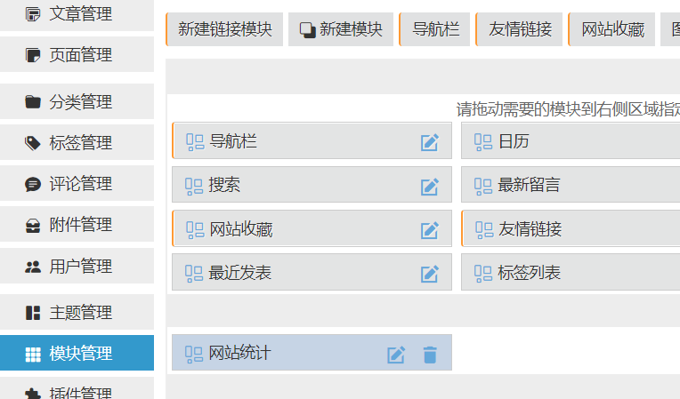

哪些数据适合做可视化
----------

我们在运营自己的网站的时候，很多时候我们希望能够掌握自己网站的数据，包括**网站的访客数量**、**网站中个分类的文章数量**、**各个月份的文章数量**等。而且很多时候我们不希望我们拿到的是冷冰冰的数据，而是一目了然的数据。这时候数据可视化就非常有用了，如果我们能够通过图表来让自己的网站的数据一目了然，岂不美哉？

数据可视化工具介绍
---------

现在网络上的前端图表库其实并不少，并且很多都是开源的，也就是说，你可以直接拿来用，而不需要付费。其中最有名气的当属由百度主导的echarts项目，现在该项目已经在Apache开源基金会孵化中。echarts是一个非常好用的图表库，不需要什么前置技能，只需要懂一点点JavaScript和json语法即可使用。echarts的图表数据使用json进行渲染。

- 如下代码就是echarts官网给出的一个简单的图表对象实例：

```json
option = {
  series: [
    {
      type: 'pie',
      data: [
        {
          value: 335,
          name: '直接访问'
        },
        {
          value: 234,
          name: '联盟广告'
        },
        {
          value: 1548,
          name: '搜索引擎'
        }
      ]
    }
  ]
};
```

上述代码中的option是对象的名字，对象中包含的series数组就是用于配置该图表的数据，其中的type字段用于确定图表的类型，pie表示类型为饼图，data数据就是饼图的各个块的数据，value表示该块的数值，name是该块的名字，更多关于echarts对象的API可以参考echarts的官方文档：[Documentation - Apache ECharts](https://echarts.apache.org/zh/api.html#echarts)

- 一个完整的实例，可直接写到HTML中用浏览器打开即可看到效果：

```html
<!DOCTYPE html>
<html lang="en">
  <head>
    <meta charset="UTF-8" />
	<script type="text/javascript" src="https://cdn.jsdelivr.net/npm/echarts@5/dist/echarts.min.js"></script>
  </head>
  <body>
    <div id="root" style="width: 600px;height: 400px;"></div>
    <script>
	var myChart = echarts.init(document.getElementById('root'))
		option = {
		  series: [
		    {
		      type: 'pie',
		      data: [
		        {
		          value: 335,
		          name: '直接访问'
		        },
		        {
		          value: 234,
		          name: '联盟广告'
		        },
		        {
		          value: 1548,
		          name: '搜索引擎'
		        }
		      ]
		    }
		  ]
		};
		myChart.setOption(option)
	</script>
  </body>
</html>
```

- 完整实例的讲解

要让图表显示出来，那就需要一个容器来放置图表。上述代码中的

```html
<div id="root" style="width: 600px;height: 400px;"></div>
```

就是用来放置图表的容器，这里需要注意，<font color="red">**一定要给容器设置宽高**</font>，因为图表都是有一定的宽度和高度的，如果不设置宽高，将会导致图表显示不出来。

脚本中的以下这句

```javascript
var myChart = echarts.init(document.getElementById('root'))
```

是根据id获取到div标签，然后用这个标签作为容器来初始化echarts图表。

以下这句是把图表放置到容器中

```javascript
var myChart.setOption(option)
```

- 完整实例的效果展示


zblog API介绍
-----------

zblog是有官方文档的，可以去官方文档中去查看相关的API：[接口文档 - API (zblogcn.com)](https://docs.zblogcn.com/php/#/books/api-10-mods)

这里我们只用到一个API即可：

请求格式：[https://example.com/zb_system/api.php?mod=category&act=list](https://example.com/zb_system/api.php?mod=category&act=list)，把example.com换成你自己的域名即可。

请求之后会返回json格式的数据，类似这样的：

然后我们复制这些文本，打开网站json.cn，解析一下json数据，查看json的结构，以便进行json解析。

可以看到，这个json对象中有一个data对象，data对象中又有一个list数组，这个数组列出了网站的所有分类的ID和分类名称，以及分类下的文章数量等：


那么我们可以想想我们需要哪些数据呢？很显然，我们只需要分类名称和该分类下的文章数量即可构建一个饼图。

而echarts图表的配置项实际上也是一个json对象，所以这就很简单了。

**思路如下**

我们只需要在我们的网站的页面加载时，请求API获取文章分类数据，然后把返回的json字符串转换成json对象（只有json对象才能解析），然后把解析出来的只赋值给option对象的相应值即可。

把文章统计图表做成zblog模块
----------------

- 打开zblog后台页面

zblogphp：https://example.com/zb_system/admin/index.php

- 点击网站设置->API设置->启用API协议


- 点击模块管理，再点击新建模块，然后复制以下代码到zblog“正文”的编辑框里面（把代码中的example.com换成你自己的网站域名），名称、文件名、HTML ID自己随便填，类型选择div，其它不管，提交即可。

模块代码

```html
<script src="https://cdn.jsdelivr.net/npm/echarts@5/dist/echarts.min.js" type="text/javascript"></script><div id="statistics" style="display:flex;flex-direction:row;justify-content:center;width:280px;height:375px"></div><script type="text/javascript">

      var chartDom = document.getElementById('statistics');
      var myChart = echarts.init(chartDom);
      var option;
      option = {
          title: {//图表的标题配置项
              text: '各分类文章数量',//图表标题
              left: 'center'//图表左右位置
          },
          tooltip: {//提示框
              trigger: 'item'//item表示在饼块上触发提示框显示
          },
          legend: {//图例的配置项
              // orient: 'vertical',
              left: 'center',//图例左右位置
              bottom: '0'//图例上下位置
          },
          series: [//“饼”的配置项
              {
                  // name: '',
                  top:'-20%',//饼图到顶部的距离
                  // left: 'center',
                  type: 'pie',//pie表示饼图
                  stillShowZeroSum: false,//数据值总数为零时是否显示饼图
                  radius: '50%',//饼图半径
                  data: [//饼图的各个块的名字和数值，可以根据需要动态地push。
                        //因为分类数量不是经常变化的，所以也可以像这样一个个地写死
                      { value: null, name: null },
                      { value: null, name: null },
                      { value: null, name: null },
                      { value: null, name: null },
                      { value: null, name: null },
                      { value: null, name: null },
                      { value: null, name: null },
                      { value: null, name: null },
                      { value: null, name: null },
                      { value: null, name: null },

                  ],
                  emphasis: {
                      itemStyle: {//这是设置样式的，相关API可以去查看官方文档
                          shadowBlur: 10,
                          shadowOffsetX: 0,
                          shadowColor: 'rgba(0, 0, 0, 0.5)'
                      }
                  }
              }
          ]
      };
      function setData() {//发送和处理zblog API的函数
          const Http = new XMLHttpRequest()
        //把下面的example.com改成你的网站域名，其它的，包括上面的都不用改
        //这里全部代码只改这一处即可，这是最简单的方法了，而且效果还挺好的，改好域名直接保存用浏览器访问
          const url = 'https://example.com/zb_system/api.php?mod=category&act=list'
          Http.open('GET',url)
          Http.send()

          Http.onreadystatechange=function(){
              if (this.readyState == 4 && this.status==200){
                  var JSONObject = JSON.parse(Http.responseText)
                for (var i = 0; i < JSONObject.data.list.length; i++) {
                    option.series[0].data[i].value = parseInt(JSONObject.data.list[i].Count)
                    option.series[0].data[i].name = JSONObject.data.list[i].Name
                }
                  myChart.setOption(option)
              }
          }
      }
      window.onload = setData
      myChart.on('click',function(params){
          var cateId = params.dataIndex+2
          window.location.href = 'https://'+window.location.host+'/category-'+cateId+'.html'
          // console.log(window.location.host+'?cate='+cateId)
      })
      option && myChart.setOption(option);

</script>
```

解决一些问题
------

- echarts饼图的“饼块”是可以添加点击事件的，一开始我使用动态网页的时候，这些点击事件没有任何问题，可以正常点击，但是当我开启了伪静态之后，就开始出现404了，因为地址重写出错。开始的时候跳转是通过cate=id的参数来跳转的，但是伪静态之后，cate变成了category-id.html，因为zblog的静态管理中心的伪静态规则是这样的，那既然这样，我就直接把点击事件的跳转地址改成category-id.html即可。（这个问题在模块代码中已经解决了）
- 分类页面切换排序出现404，分类页面点击 当前位置：首页 > 分类名称 里的分类名称时404。这个问题其实也是伪静态URL重写出了问题，我们在访问分类页面的时候访问的是带参数cate=id的URL，例如：例如：[https://www.example.com/?cate=4](https://www.example.com/?cate=4)，但是当我们切换排序的时候，URL被重写成：[https://www.example.com/?order=newlist&sort=0](https://www.example.com/?order=newlist&sort=0)，分类参数丢失导致404。其实也是cate=id参数变成了category-id。这个问题通过上面第一种情况的设置可以解决。
- 从顶部分类访问分类页面，点击侧栏的最近发表出现404。这个问题也是URL重写的问题，很简单：

1. 打开zblog后台页面，选择分类管理
2. 点击导航管理
3. 把各个分类的连接改成诸如：[https://www.example.com/category-2.html](https://www.example.com/category-2.html)的格式

- 点击标签404，我本人使用静态规则：tags-*.html，出现过404，页出现过id参数乱码，后来经过验证，发现是CDN缓存中的内容版本不是最新的所导致的，把tags-*.html这个规则中的alias别名参数解析到了上面那个规则的id参数的地方导致出错404.
