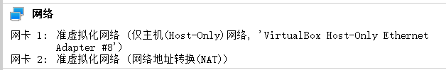

# 解决genymotion虚拟机无法启动的问题

## 解法一

genymotion是依赖于virtualbox的

- 打开virtualbox

- 点击你的genymotion对应的那个虚拟机

- 查看右边网络那一栏对应的网络适配器

  

- 右键点击电脑右下角的网络图标，打开网络与共享中心（打开“网络和Internet”设置）

- 更改适配器选项

- 在网络适配器上悬停鼠标，查看哪个是你的virtualbox那边对应的适配器

- 查看此适配器是否是打开状态（由于某些bug，有时候显示“已禁用”的适配器实际上是打开状态。要右键此适配器，如果显示启动，那么就是关闭状态，否则就是打开状态。），如果未打开，打开即可。

**注意，启动的过程中可能会疯狂请求管理员权限，请同意**

## 解法二

如果解法一不奏效，可能会是genymotion和virtualbox的兼容性问题，那就解法二了

- 去genymotion官网下载genymotion with virtualbox，如图，下面那个便是

- 安装好之后可能会提示找不到virtualbox，那可能是你的电脑安全软件拦截了，因为安装virtualbox的时候会请求管理员权限，安装genymotion的过程中会同步安装virtualbox，如果被拦截了就会安装不上，要注意查看安全软件的提示，或者直接把安全软件关掉
- 上面就绪之后，去genymotion里面安装一个你需要的虚拟机，然后启动，仍然启动失败，提示“找不到网卡......”或者“找不到适配器......”之类的有关网络的提示
- 按照解法一的步骤打开适配器即可