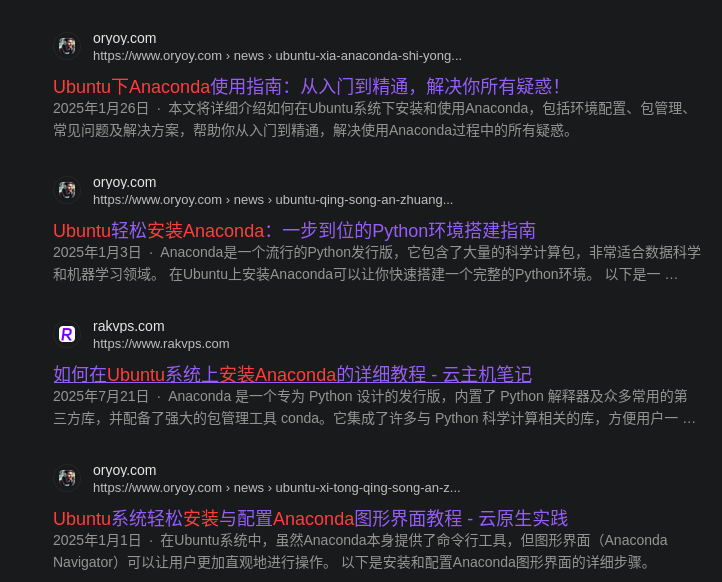
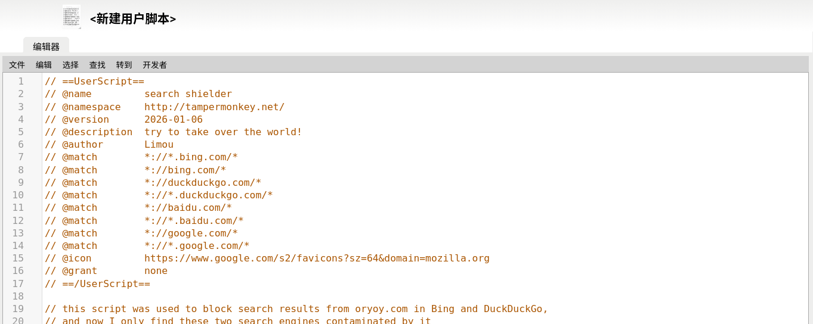
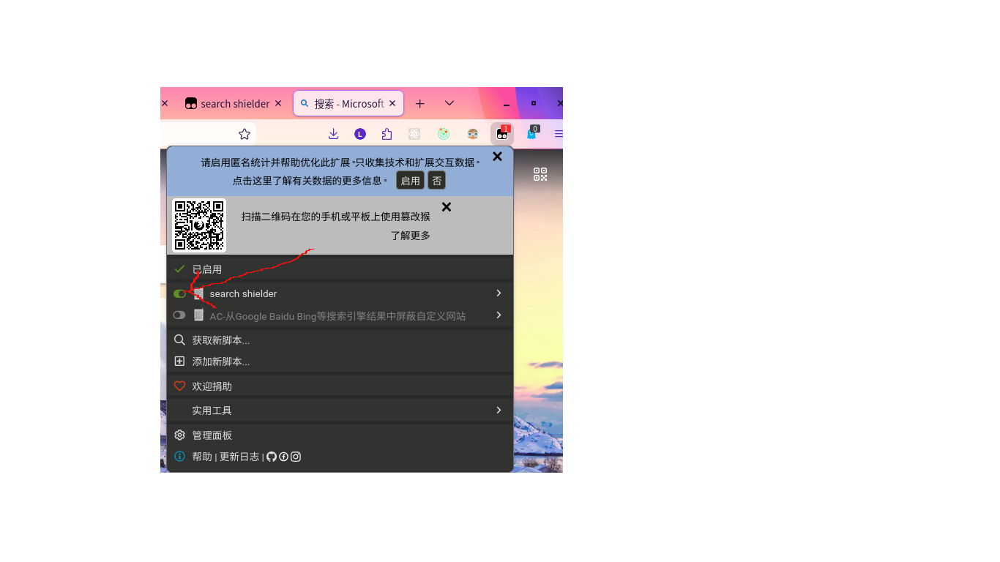

## 事情起因
### 最近使用必应搜索技术类关键词，经常出现一个垃圾网站，名为“云原生实践”，域名oryoy.com，这网站不仅经常出现，还占据大量篇幅，有时候10条搜索结果中可能有5条是这个网站。


可以看到一页搜索结果就有三个这个网站
直到有一天我确实感觉很烦，而且这网站的内容一看就是用比较差的AI生成的，通篇垃圾，没有什么参考价值，于是我打开了它的网站主页，不看不知道，一看吓一跳，好家伙


一页有多少篇文章我都不想数了，实在太多，于是我打开了控制台

可以看到一页是100篇文章，通过改变query参数看了一下页数，截止到当天下午4点，当天发布的文章已经达到了301页，也就是3万多篇，照这个节奏，这个网站一天就能生成4万~5万篇垃圾文章，并且通过疯狂的SEO推向Bing，严重污染搜索引擎。
<br>
除了Bing以外，我发现被污染的搜索引擎还有DuckDuckGo，但没有Bing那么严重，而百度和Google暂未发现被污染，也许是网站运营者没有去提交，亦可能是搜索引擎收录机制的差异。总之，此类网站的出现真是AI和搜索引擎的一大悲哀啊，太影响使用体验了。
<br>

## 动手解决
于是我尝试寻找可以屏蔽搜索引擎搜索结果的插件或者油猴脚本，但发现没有什么兼容性比较好的选择，总有漏网之鱼，最后只能自己编写了。
<br>
脚本很简单,代码行数不多,寻找页面特征元素并编写合适的选择器才是关键。然而未来搜索引擎网页结构可能改变，这些可能也就失效了，不过呢，我也会时常更新的，敬请关注。

### 代码
```javascript
// ==UserScript==
// @name         search shielder
// @namespace    http://tampermonkey.net/
// @version      2026-01-06
// @description  try to take over the world!
// @author       Limou
// @match        *://*.bing.com/*
// @match        *://bing.com/*
// @match        *://duckduckgo.com/*
// @match        *://*.duckduckgo.com/*
// @match        *://baidu.com/*
// @match        *://*.baidu.com/*
// @match        *://google.com/*
// @match        *://*.google.com/*
// @icon         https://www.google.com/s2/favicons?sz=64&domain=mozilla.org
// @grant        none
// ==/UserScript==

// this script was used to block search results from oryoy.com in Bing and DuckDuckGo,
// and now I only find these two search engines contaminated by it

(function() {
    'use strict';

    // Your code here...
    // 屏蔽列表，可自行添加
const shieldingURLs = [
    'oryoy.com',
    'githubup.com',
    'githubrsp.com'
]
// 当前地址路径
const currentLocation = window.location.href

// 预编译正则匹配
const isBing = /\S*:\/\/\S*bing.com\/\S*/.test(currentLocation)
const isDuckDuckGo = /\S*:\/\/\S*duckduckgo.com\/\S*/.test(currentLocation)
const isBaidu = /\S*:\/\/\S*baidu.com\/\S*/.test(currentLocation)
const isGoogle = /\S*:\/\/\S*google.com\/\S*/.test(currentLocation)

// 是否已经存在 SPA 监听器
let existSPAListener = false

// 入口函数
function start() {
    SPAListener()
    // 针对 Bing 的屏蔽匹配
    if (isBing) {
        console.log('Bing DOM变化')
        debounce(shieldBing(), 1000)()
    }
    // 针对 DuckDuckGo 的屏蔽匹配
    else if (isDuckDuckGo) {
        console.log('Duck DOM变化')
        debounce(shieldDuckDuckGo(), 1000)()
    }
    else if (isBaidu) {
        console.log(`百度DOM变化`);
        debounce(shieldBaidu(), 1000)()
    }
    else if (isGoogle) {
        console.log(`Google DOM 变化`);
        debounce(shieldGoogle(), 1000)()
    }
}

// 获取 Google 的结果 item 容器
function getItemParentNode(node) {
    for (let i = 0; i < 12; i++) {
        node = node.parentNode
    }
    return node.parentNode.getAttribute('id') === 'rso' ? node : node.parentNode
}

// 屏蔽 Google 搜索结果
function shieldGoogle() {
    const googleWaitToRemoves = []
    const nodes = document.querySelectorAll('cite')
    nodes.forEach(node => {
        const domain = node.innerText
        console.log(node)
        if (shieldingURLs.some(url => domain.includes(url))) {
            const itemContainer = getItemParentNode(node)
            // 先隐藏，并加入数组
            itemContainer.setAttribute('style', 'display: none')
            googleWaitToRemoves.push(itemContainer)
        }
    })
    // 批量删除，防止阻塞DOM渲染
    removeElementsBatch(googleWaitToRemoves, 0)
}

// 屏蔽 DuckDuckGo 搜索结果
function shieldDuckDuckGo() {
    const ddgWaitToRemoves = []
    const nodes = document.getElementsByClassName('react-results--main')[0].querySelectorAll("li[data-layout='organic']")
    console.log(nodes);
    for (const node of nodes) {
        const href = node.querySelector('article > div > div > div > a').getAttribute('href')
        if ((href && shieldingURLs.some(url => href.includes(url)))) {
            let li = queryBingLi(node)
            if (li) {
                li.setAttribute('style', 'display: none')
                ddgWaitToRemoves.push(li)
            }
        }
    }
    removeElementsBatch(ddgWaitToRemoves, 0)
}

// 屏蔽 Bing 搜索结果
function shieldBing() {
    const bingWaitToRemoves = []
    // 从一般搜索结果中去除
    const nodes = document.querySelectorAll('#b_results .b_algo')
    for (const node of nodes) {
        const ariaLabel = node.querySelector('a').getAttribute('aria-label')
        const href = node.querySelector('a').getAttribute('href')
        if ((ariaLabel && shieldingURLs.some(url => ariaLabel.includes(url))) || (href && shieldingURLs.some(url => href.includes(url)))) {
            let li = queryBingLi(node)
            if (li) {
                li.setAttribute('style', 'display: none')
                bingWaitToRemoves.push(li)
            }

        }
    }
    // 从 bing 结果页顶部内容中去除
    const headerDivs = document.getElementsByClassName('gs_cits')[0]?.querySelectorAll('.gs_cit')
    if (headerDivs)
        headerDivs.forEach(headerDiv => {
            const dataUrl = headerDiv.getAttribute('data-url')
            if (shieldingURLs.some(url => dataUrl.includes(url))) {
                headerDiv.setAttribute('style', 'display: none')
                bingWaitToRemoves.push(headerDiv)
            }
        })
    removeElementsBatch(bingWaitToRemoves, 0)
}
// 触发 history push 时，同时会触发 spaNavigation
function SPAListener() {
    const pushState = history.pushState
    history.pushState = function (state, title, url) {
        // 插入一个事件监听器
        window.dispatchEvent(new CustomEvent('spaNavigation', { detail: { url, type: 'push' } }))
        // 让原函数正常运行
        return pushState.apply(this, arguments)
    }
    if (!existSPAListener)
        window.addEventListener('spaNavigation', (e) => {
            console.log('监听到路由变化')
            if (isBaidu) {
                debounce(shieldBaidu(), 500)()
            }
            else if (isDuckDuckGo) {
                debounce(shieldDuckDuckGo(), 500)()
            }
        })
}

// 百度去广告
function shieldBaidu() {
    const baiduWaitToRemoves = []

    // 一般屏蔽
    const resultList = document.querySelectorAll('#content_left > div')
    if (resultList)
        resultList.forEach(result => {
            const mu = result.getAttribute('mu')
            if (mu && shieldingURLs.some(url => mu.includes(url))) {
                result.setAttribute('style', 'display: none')
                baiduWaitToRemoves.push(result)
            }
        })
    // 去除一般广告
    const adsNodes = document.querySelectorAll("div[prank='1'], div[prank='2'], div[prank='3'], div[prank='4']")
    if (adsNodes)
        adsNodes.forEach(node => {
            node.setAttribute('style', 'display: none')
            baiduWaitToRemoves.push(node)
        })
    // 去除品牌广告
    const topAdsNode = document.querySelector('.tenon_pc_comp_content_container.c-border')
    if (topAdsNode) {
        topAdsNode.parentNode.setAttribute('style', 'display: none')
        baiduWaitToRemoves.push(topAdsNode.parentNode)
    }
    // 去除底部广告
    const bottomAdNodes = document.querySelectorAll('.result.c-container.new-pmd a')
    console.log('所有', bottomAdNodes)
    if (bottomAdNodes)
        bottomAdNodes.forEach(node => {
            const isAds = node.innerText === '广告'
            if (isAds) {
                node.parentNode.parentNode.setAttribute('style', 'display: none')
                baiduWaitToRemoves.push(node.parentNode.parentNode)
            }
        })
    removeElementsBatch(baiduWaitToRemoves, 0)
}

// Bing 从特征节点向外查找父级 li 元素
function queryBingLi(node) {
    while (node && node.nodeName !== 'LI') {
        node = node.parentNode
        if (!node || node.nodeName === 'HTML') return null
    }
    return node
}

// 批量删除节点
function removeElementsBatch(elements, timeout) {
    setTimeout(() => {
        elements.forEach(el => {
            if (el && el.parentNode) {
                el.parentNode.removeChild(el)
            }
        }, timeout)
    })
}

function debounce(func, wait) {
    let timeout;
    return function executedFunction(...args) {
        const later = () => {
            clearTimeout(timeout);
            func.apply(this, args);
        };
        clearTimeout(timeout);
        timeout = setTimeout(later, wait);
    }.bind(this);
}

let isProcessing = false
const observer = new MutationObserver(mutations => {
    if (isProcessing) return
    isProcessing = true
    // 防抖，防止 DOM 频繁变化导致频繁调用
    setTimeout(() => {
        start()
        isProcessing = false
    }, 100);
})
observer.observe(document.body, {
    childList: true,
    subtree: true
})
})();
```

### 安装使用
以Firefox为例，点击右上角的模块图标

<br>
进入浏览器扩展管理页面，搜索tampermonkey，安装扩展，并将扩展固定到工具栏


<br>
tampermonkey安装后其扩展名称为“篡改猴”
<br>
点击工具栏中的tampermonkey图标，选择添加新脚本

清空其中原有的内容，复制并粘贴以上代码，Ctrl+S或者点文件——>保存。

完成
<br>
接下来来到Google/Bing/百度/DuckDuckGo任意搜索引擎页面，点击右上角的篡改猴扩展图标，search shielder就是刚才添加的脚本，我们需要点击左边的开关启用这个脚本

<br>
下面是屏蔽前后效果演示


<br>
脚本在Ubuntu系统的Firefox、Zen Browser和Edge上测试基本上没有什么问题，其它的未测试。
> 手机端也能用，但由于页面结构可能有细微不同，效果可能会有些许不同。支持脚本的手机浏览器：Firefox、Edge、Via、X浏览器。